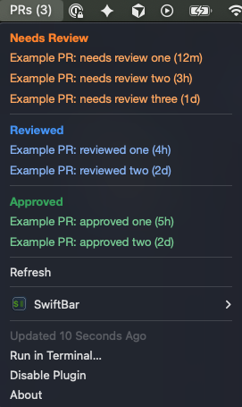

# swiftbar-github-prs

A [SwiftBar](https://github.com/swiftbar/SwiftBar) plugin that shows GitHub pull
requests waiting on you, right in the macOS menu bar:

- **Needs Review** — open PRs that requested your review and aren't approved yet.
- **Reviewed** — open PRs you've already reviewed (e.g. left comments or requested
  changes) that aren't approved yet. GitHub drops you from the review-requested
  list once you submit a review, so these would otherwise disappear.
- **Approved** — open PRs assigned to you that have been approved.

Each entry links straight to the PR and shows how long it's been open. The token
is read from the macOS Keychain, so it never lives in the script.

## Preview



## Requirements

- macOS with [SwiftBar](https://github.com/swiftbar/SwiftBar) installed
  (`brew install swiftbar`)
- Python 3 — the plugin uses the system `/usr/bin/python3` and the standard
  library only, so there's nothing extra to install.

## Setup

### 1. Create a GitHub token

Generate a token at
[github.com/settings/tokens](https://github.com/settings/tokens). A classic
token with the `repo` scope (or a fine-grained token with read access to pull
requests) is enough.

### 2. Store the token in the Keychain

Save it as a generic password. Pick any account/service names you like — just
remember them for the next step:

```bash
security add-generic-password \
  -a "your-keychain-account" \
  -s "your-keychain-token" \
  -w "ghp_yourGeneratedToken"
```

- `-a` is the **account** (maps to `KEYCHAIN_ACCOUNT` in the script)
- `-s` is the **service** (maps to `KEYCHAIN_TOKEN` in the script)
- `-w` is the token value

### 3. Configure the script

Edit the constants at the top of `fetch-prs.5m.py` so they match your GitHub
username and the names you used above:

```python
GITHUB_USERNAME = "your-github-username"
KEYCHAIN_ACCOUNT = "your-keychain-account"
KEYCHAIN_TOKEN = "your-keychain-token"
```

### 4. Install the plugin

Copy the script into your SwiftBar plugins folder and make it executable:

```bash
chmod +x fetch-prs.5m.py
```

Then refresh SwiftBar (menu bar → **SwiftBar → Refresh All**, or just quit and
reopen). The `5m` in the filename sets the refresh interval — rename it to taste,
e.g. `fetch-prs.1m.py` for every minute.
